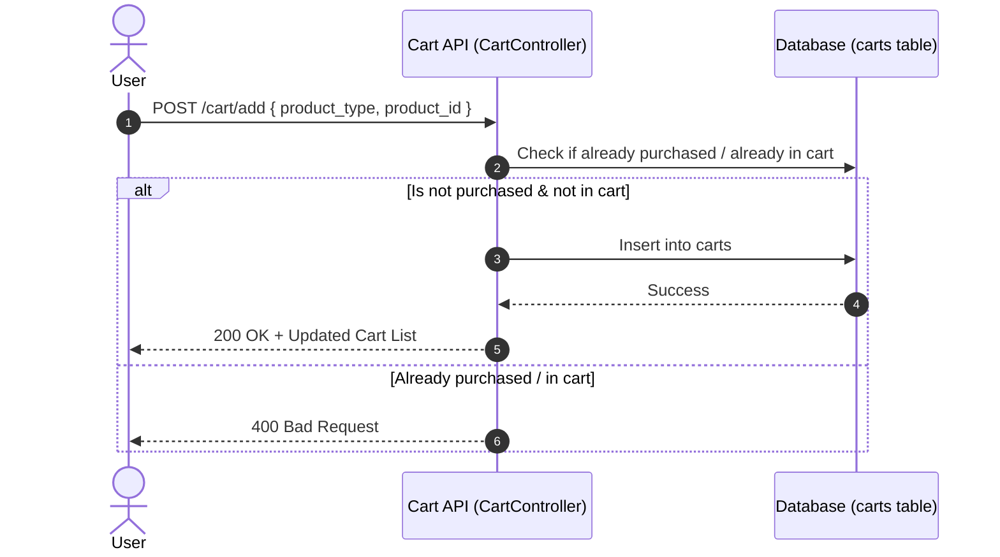
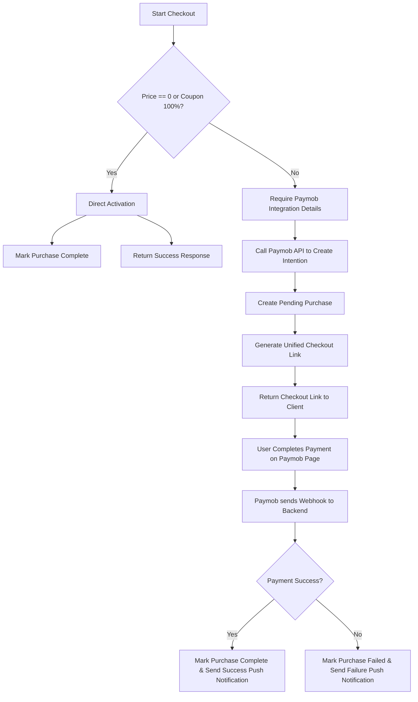

# User Flow: Selection, Cart, and Payment Systems

This document describes the complete developer guide and API documentation for browsing products (courses/books), managing them in a shopping cart, checking out, and processing payments.

---

## 1. Product Discovery & Selection

Before adding items to the cart or checking out, users browse courses or books.

### 1.1 List Courses
- **Endpoint**: `GET /api/v1/online/courses-api`
- **Controller Method**: `CourseController@index`
- **Authentication**: Optional
- **Response**: List of courses with titles, prices, levels, subjects, and purchase/favorite status.

### 1.2 List Books
- **Endpoint**: `GET /api/v1/online/books-api`
- **Controller Method**: `BookController@index`
- **Authentication**: Optional
- **Response**: List of books with author, price, availability count, etc.

---

## 2. Shopping Cart Management

The shopping cart allows authenticated users to save products they want to buy.



### 2.1 Get Cart Items
- **Endpoint**: `GET /api/v1/online/cart`
- **Headers**: `Authorization: Bearer <token>`
- **Response Example**:
  ```json
  {
    "status": true,
    "msg": "تم استرجاع السلة بنجاح",
    "data": [
      {
        "id": 1,
        "user_id": 5,
        "purchastable_id": 3,
        "purchastable_type": "courses",
        "created_at": "2026-07-14 12:00:00",
        "details": {
          "id": 3,
          "title": "كورس تعليم الرسم بالألوان المائية",
          "price": 300,
          "teacher_name": "أحمد علي"
        }
      }
    ]
  }
  ```

### 2.2 Add to Cart
- **Endpoint**: `POST /api/v1/online/cart/add`
- **Headers**: `Authorization: Bearer <token>`
- **Payload**:
  ```json
  {
    "product_type": "course", // or "book"
    "product_id": 3
  }
  ```
- **Validation Rules**:
  - Checks if user has already purchased the product with status `complete`.
  - Checks if the item is already in the cart.
- **Response**: `200 OK` with the updated list of cart items.

### 2.3 Remove from Cart
- **Endpoint**: `POST /api/v1/online/cart/remove`
- **Headers**: `Authorization: Bearer <token>`
- **Payload**:
  ```json
  {
    "product_type": "course",
    "product_id": 3
  }
  ```
- **Response**: `200 OK` with the updated list of cart items.

### 2.4 Clear Cart
- **Endpoint**: `POST /api/v1/online/cart/clear`
- **Headers**: `Authorization: Bearer <token>`
- **Response**: `200 OK` with an empty array of data.

---

## 3. Checkout and Payment Processing

Currently, checkout and payments are processed via Paymob.



### 3.1 Direct Checkout Endpoint
- **Endpoint**: `POST /api/v1/online/checkout`
- **Headers**: `Authorization: Bearer <token>`
- **Payload**:
  ```json
  {
    "product_type": "course", // "course" or "book"
    "product_id": 3,
    "cobon_code": "DISCOUNT50", // optional
    "integration_id": "4628514", // required if price > 0
    "iframe_token": "token_here" // required if price > 0
  }
  ```

### 3.2 Backend Code Flow

Here are the key controller logic steps in `PaymentController@direct_checkout`:

#### A. Price Calculation & Coupon Validation
```php
$price = (float) ($product->price ?? 0);
if ($cobon) {
    if ($cobon->discount_type == 'fixed') {
        $price = max(0, $price - $cobon->discount);
    } elseif ($cobon->discount_type == 'percentage') {
        $price = max(0, $price - ($price * ($cobon->discount / 100)));
    }
}
```

#### B. Handle Free Checkout (Price <= 0)
If the price is free or discount makes it 0, the product is activated immediately without initiating a Paymob request.
```php
if ($price <= 0) {
    $purchase = $product->purchases()->create([
        'user_id' => $user->id,
        'status' => 'pending',
        'cobon_id' => $cobonId,
    ]);

    $paymentResult = $this->paymentService->process($purchase, 'free', $user);
    if ($paymentResult['success']) {
        return ApiResponseService::response([
            'status' => 200,
            'msg'    => 'تم تفعيل المنتج بنجاح بدون دفع لأنه مجاني.',
            'data'   => [
                'purchase' => new PurchaseResource($purchase),
                'direct_activation' => true,
            ]
        ]);
    }
}
```

#### C. Handle Paid Checkout (Price > 0)
If price is greater than 0, we create a pending purchase and request Paymob for a payment checkout URL.
```php
$purchase = $product->purchases()->create([
    'user_id' => $user->id,
    'status' => 'pending',
    'cobon_id' => $cobonId,
]);

$paymentResult = $this->paymentService->process($purchase, 'online_card', $user, $request->integration_id);

if ($paymentResult['success']) {
    return ApiResponseService::response([
        'status' => 200,
        'msg'    => 'تم إنشاء رابط الدفع بنجاح.',
        'data'   => [
            'purchase'             => new PurchaseResource($purchase),
            'direct_activation'    => false,
            'payment_intention_id' => $paymentResult['payment_intention_id'],
            'payment_url'          => $paymentResult['payment_url'],
        ]
    ]);
}
```

---

## 4. Payment Verification (Webhook)

When the user completes payment on the Paymob iframe/page, Paymob hits our webhook endpoint.

- **Endpoint**: `POST /api/v1/online/payment/webhook` (Publicly accessible, called by Paymob)
- **Controller Method**: `PaymentController@webhook`
- **Execution Flow**:
  1. Retrieves the `success` status and Paymob `id` (transaction ID).
  2. Identifies the purchase via `$data['extras']['purchase_id']`.
  3. Updates database status:
     - **Success**: Status changes to `'complete'`, logs `transaction_id`.
     - **Failure**: Status changes to `'failed'`.
  4. Fenders push notification to the user device using `NotificationService::send`:
     - Success message: *"تم تفعيل طلبك بنجاح لـ {اسم المنتج}"*
     - Failure message: *"نعتذر، فشلت عملية الدفع لـ {اسم المنتج}"*
